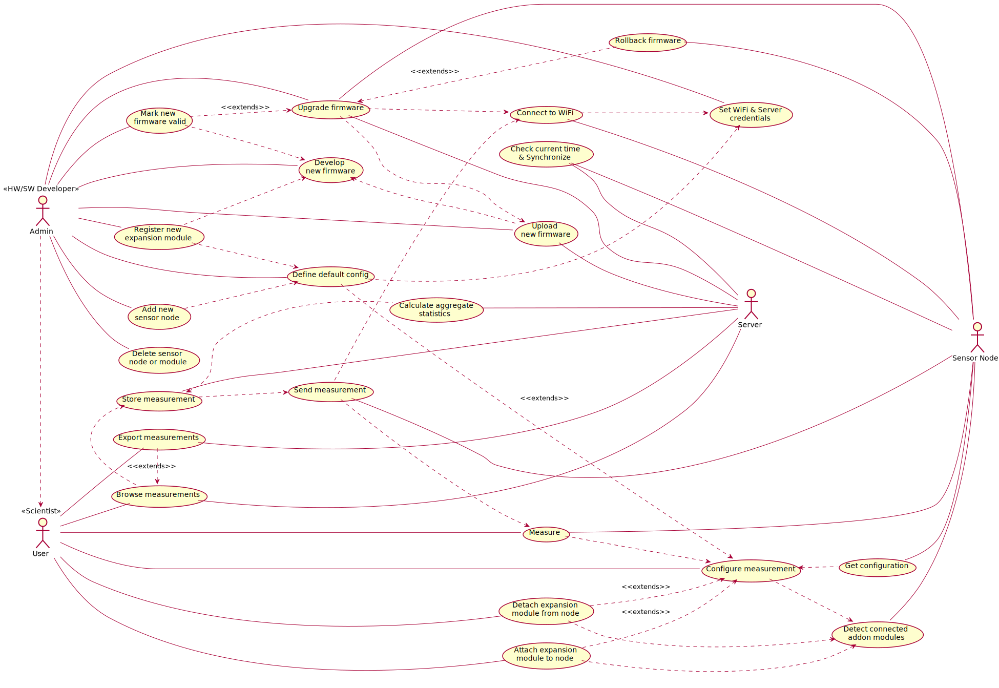
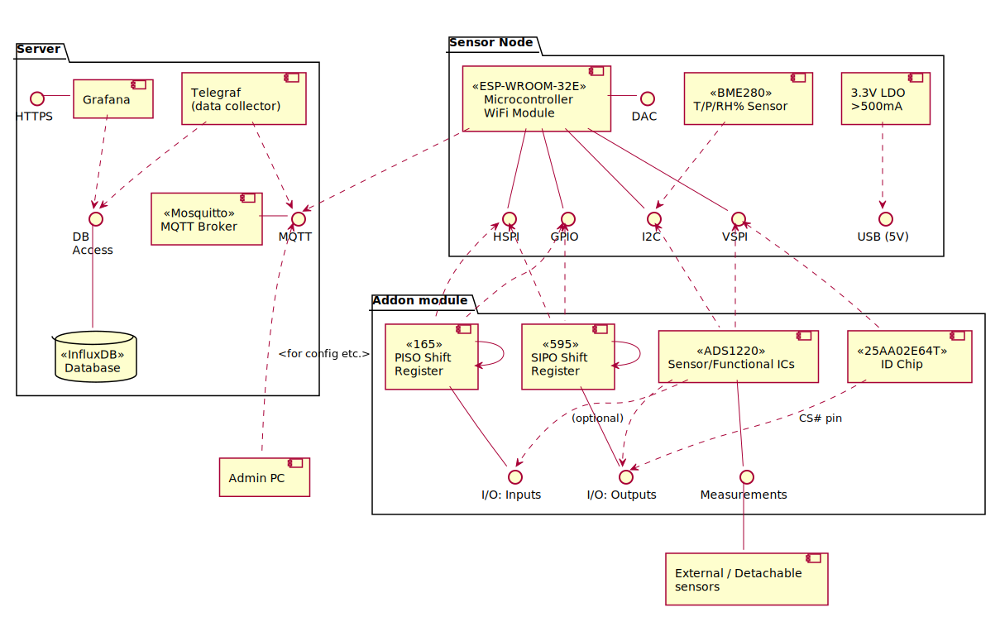
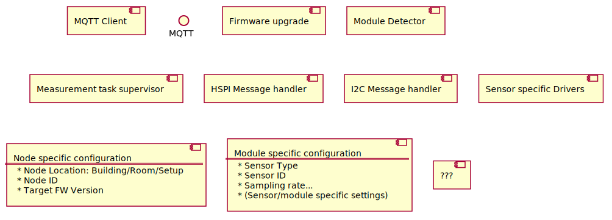

# Planning document

Lumping all planning in one document, until there is enough stuff to justify splitting to multiple documents. 
All .puml diagrams should have a matching .svg rendered. 

### Usecase diagram

### System ? Component diagram

### Microcontroller FW Component diagram

